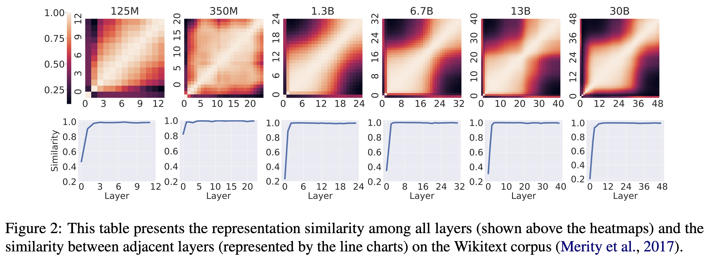

# CRaSh
The source code of the EMNLP 2023 main conference paper: [CRaSh: Clustering, Removing, and Sharing Enhance Fine-tuning without Full Large Language Model.](https://aclanthology.org/2023.emnlp-main.597/)

In summary, our main contributions in this paper can be summarized as follows:

- We discover emergence of modular structure within layers along with size of model increase in decoder-only models (e.g., OPT and LLaMA), which shows clusters of similar representations across layers.
- We propose CRaSh, a training-free strategy to enhance layer dropping compression. CRaSh improves the performance of fine-tuning without full model and even outperforms knowledge distillation on multiple datasets.
- We analyze the optima of fine-tuning with and without full model through the lens of loss surface and mode connectivity, which shows the two minima fall over the same basin and are connected linearly in parameter space. This observation explains the effectiveness of CRaSh.

## Empirical Study

### Representation Similarity



- Computing representation similarity via CKA among layers in LLMs

  ```bash
  bash scripts/run_utils_main_sim.py
  ```


### Functional Similarity


- Runing tuned-lens experiments among layers in LLMs

  ```bash
  bash scripts/run_utils_main_tuned_lens_cluster.sh
  ```

  

## CRaSh Framework


For the implementation of CRaSh method, we mainly modified training code from [OffsiteTuning](https://github.com/mit-han-lab/offsite-tuning/), where we rewrite the layer selection functions as shown in `src/train.py`.

- Step 1: Running layer cluster

  ```bash
  bash scripts/run_utils_layer_cluster.sh
  ```

- Step 2: Finetuning models with CRaSh method

  ```bash
  bash scripts/run_src_train_1.3b.sh
  
  bash scripts/run_src_train_6.7b.sh
  ```

- Step 3: Evaluate the trained models with lm-eval

  ```bash
  bash scripts/run_src_eval_1.3b.sh
  
  bash scripts/run_src_eval_6.7b.sh
  ```

  

## Experimental Results

### Main Results


### Ablation Study


- Visualize the interplote plots on finetuned models

  ```bash
  bash scripts/run_utils_interp_1d.sh
  
  bash scripts/run_utils_interp_2d.sh
  ```

  

## Citation

```
@inproceedings{zhang-etal-2023-crash,
    title = "{CR}a{S}h: Clustering, Removing, and Sharing Enhance Fine-tuning without Full Large Language Model",
    author = "Zhang, Kaiyan  and
      Ding, Ning  and
      Qi, Biqing  and
      Zhu, Xuekai  and
      Long, Xinwei  and
      Zhou, Bowen",
    editor = "Bouamor, Houda  and
      Pino, Juan  and
      Bali, Kalika",
    booktitle = "Proceedings of the 2023 Conference on Empirical Methods in Natural Language Processing",
    month = dec,
    year = "2023",
    address = "Singapore",
    publisher = "Association for Computational Linguistics",
    url = "https://aclanthology.org/2023.emnlp-main.597",
    doi = "10.18653/v1/2023.emnlp-main.597",
    pages = "9612--9637"
```

